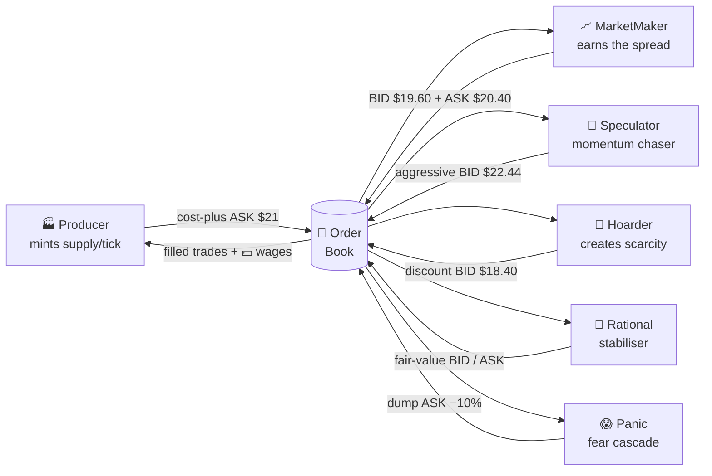
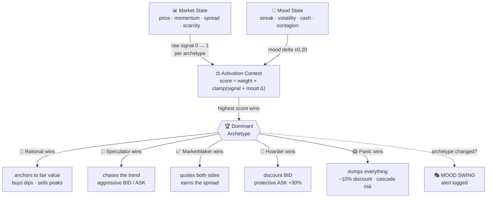
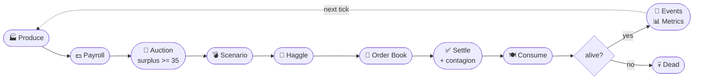
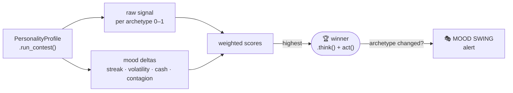

<div align="center">

# 📊 Simple Market Simulator

### *A decentralized, agent-based market where every trader thinks out loud.*

Model price equilibrium, autonomous haggling, systemic liquidity risk, and a full
**survival economy** — consumption, starvation, production, wages — with complete
thought-process transparency for every agent.


</div>

---

## 🧭 Table of Contents

| | | |
|---|---|---|
| [✨ Highlights](#-highlights) | [🚀 Quick Start](#-quick-start) | [🎮 The GUI](#-the-gui) |
| [🧠 The Agent Zoo](#-the-agent-zoo) | [🎭 Hybrid NPCs](#-hybrid-npcs-simulation-2) | [🤖 LLM-Backed Agents](#-llm-backed-agents) |
| [🔄 The Survival Economy](#-the-survival-economy) | [🔨 English Auction](#-english-auction) | [💥 Failure Scenarios](#-failure-scenarios) |
| [🏗️ Architecture](#️-architecture) | [🧪 Behavioral Test Suites](#-behavioral-test-suites) | [🗺️ Roadmap](#️-roadmap) |
| [🔮 What's Next](#-whats-next--potential-upgrades) | [📁 Project Structure](#-project-structure) | [🎛️ CLI Reference](#️-cli-reference) |
| [🛠️ Tech Stack](#️-tech-stack) | | |

---

## ✨ Highlights

> **Every agent thinks out loud.** Before acting, each one logs *what it sees, what it
> infers, and why* it chose to bid, ask, or hold. The market is legible — not a black box.

- 🧠 **Two simulations** — pure-archetype "Agent Zoo" and mood-driven "Hybrid NPCs"
- 🤖 **Real LLM brains** — back agents with **Ollama** (free/local), **OpenAI**, or **Anthropic**; run multiple models head-to-head
- 🤝 **Bilateral haggling** — agents negotiate round-by-round before hitting the order book
- 🔨 **English auction** — when the Producer has a surplus backlog, a competitive ascending-price auction clears it; each archetype bids according to its own strategy and drops out at its private ceiling
- 📡 **Event pipeline** — Kafka-shaped `EventBus` with audit trail + live anomaly detection
- 💥 **Stress scenarios** — reproduce panic cascades, hoarding crashes, speculator bubbles
- 🔄 **A living economy** — agents *consume to survive*, *starve and die*, a *Producer* supplies the market, and *wages* recirculate cash
- 🎮 **Interactive TUI** — watch agents reason, trade, and talk in real time
- 🧪 **496 tests** across 21 files — including 30 behavioral prediction tests and 42 auction-mechanism tests

---

## 🚀 Quick Start

```bash
# 1️⃣  Set up
python -m venv .venv
.venv\Scripts\activate            # Windows
# source .venv/bin/activate       # macOS / Linux
pip install -r requirements.txt

# 2️⃣  Launch the interactive GUI  (the fun way)
python main.py --gui

# 3️⃣  …or run headless in the terminal
python main.py --sim zoo --ticks 30 --metrics
```

<table>
<tr><th>Try this…</th><th>…to see this</th></tr>
<tr><td><code>--sim zoo</code></td><td>5 pure archetypes in a <b>live survival economy</b> (consume=3, salary=70 by default)</td></tr>
<tr><td><code>--sim hybrid --haggle</code></td><td>Mood-driven NPCs that negotiate — survival economy on by default</td></tr>
<tr><td><code>--sim zoo --consume 0 --salary 0</code></td><td>Disable survival economy — market <b>freezes</b> after early ticks (no buying pressure)</td></tr>
<tr><td><code>--sim zoo --consume 6 --salary 0</code></td><td>A <b>collapse</b> — agents starve one by one ☠️</td></tr>
<tr><td><code>--scenario panic_cascade --events</code></td><td>A market crash with live anomaly alerts</td></tr>
<tr><td><code>--sim zoo --auction</code></td><td>Producer surplus triggers an <b>ascending-price auction</b> — watch each archetype bid and drop out round by round 🔨</td></tr>
<tr><td><code>--llm ollama:llama3.2</code></td><td>Agents that <b>actually reason</b> via a real LLM 🤖</td></tr>
</table>

---

## 🎮 The GUI

A full in-terminal dashboard (built on [Textual](https://textual.textualize.io/)) — no browser needed.

```
┌─ Controls ──┬──── Agent Thoughts ─────┬── Market State ──┐
│ ▸ Sim mode  │  >> Speculator  tick 8  │  Price  $21.20   │
│ ▸ Scenario  │   > UPTREND +4.9%       │  Bid    $21.68   │
│ ▸ Speed     │   BID 12 @ $21.68       │  Ask    $21.00   │
│ ▸ Consume   │  >> Hoarder             │  ▁▂▃▅▆▇ sparkline │
│ ▸ Salary    │   > Still 40 short      │  ┌─────────────┐ │
│ [START][STEP]│   BID 5 @ $21.40       │  │ Agent  NW   │ │
│ [PAUSE][RESET]│ >> Producer            │  │ 🏭 P  $6.5k │ │
│ Speed: Normal│   + PRODUCED 25 units  │  │ 🚀 Sp $812  │ │
│ Tick: 8/30  │   $ PAYROLL $70 ea.     │  └─────────────┘ │
├─────────────┴─────────────────────────┴──────────────────┤
│ Console Log              │ Trade Talk                      │
│ [08] TRADE Sp ← P @ $21  │ Producer: "Shipped at cost+."   │
│ [08] PAYROLL $70 × 5     │ Speculator: "To the moon! 🚀"   │
│ [08] ☠ DEATH Panic       │ Hoarder: "Mine now. Never enuf."│
└──────────────────────────┴─────────────────────────────────┘
```

| ⌨️ Key | Action | | ⌨️ Key | Action |
|:---:|---|---|:---:|---|
| `Space` | ▶️ Start / Pause | | `+` / `-` | ⏩ Faster / ⏪ Slower |
| `S` | 👣 Step one tick | | `R` | 🔄 Reset |
| `Q` | 🚪 Quit | | | |

> 💡 **Tip:** Press `Space` to run, then tap `-` a few times to slow it right down and
> watch each agent reason *one at a time*. Speed adjusts live — no restart needed.

---

## 🧠 The Agent Zoo

Five pure archetypes, each a fixed personality with its own decision logic and failure mode.

| | Agent | Behavior | ⚠️ Pathology |
|:---:|---|---|---|
| 📈 | **MarketMaker** | Quotes both sides; widens spread under volatility | Inventory imbalance in one-sided flows |
| 🚀 | **Speculator** | Momentum chaser; pays up to enter, dumps to exit | Amplifies bubbles & crashes |
| 🐉 | **Hoarder** | Accumulates below market; releases at steep premium | Artificial scarcity → liquidity crash |
| 😱 | **Panic** | Calm until price cracks, then dumps *everything* | Sell-off cascades |
| 🧮 | **Rational** | Anchors to fair value; buys low, sells high quietly | Slow, but stabilizes the market |
| 🏭 | **Producer** | Mints supply each tick, sells at a cost-plus anchor | The economy's supply source & employer |



**How each archetype reacts to market conditions:**

| Market state | 📈 MarketMaker | 🚀 Speculator | 🐉 Hoarder | 😱 Panic | 🧮 Rational |
|---|---|---|---|---|---|
| Rising trend (+10%) | BID+ASK, wider spread | **Aggressive BID** | Discount BID | HOLD | HOLD (fair value) |
| Falling trend (−10%) | BID+ASK, wider spread | **Dump ASK** | Discount BID | **DUMP ALL** 💥 | BID (it's cheap) |
| Flat / stable | BID+ASK, tight spread | HOLD | Discount BID | HOLD | HOLD |
| Price crash (−20%) | BID+ASK, very wide | Aggressive ASK | Discount BID | **💥 PANIC CASCADE** | **Strong BID** |
| Far below fair value | BID+ASK | BID if trend up | More aggressive BID | HOLD | **Strong BID** |
| Far above fair value | BID+ASK | ASK if trend down | HOLD (protects hoard) | HOLD | **Strong ASK** |
| Low inventory | BID only (restock) | No sell | More aggressive BID | HOLD | Normal |
| Inventory maxed | ASK only (offload) | HOLD (no room) | ASK at +30% premium | HOLD | Normal |

---

## 🎭 Hybrid NPCs (Simulation 2)

> **The idea:** real traders aren't *always* rational or *always* panicking — they shift
> between modes depending on what's happening. Each Hybrid NPC carries **2–3 embedded
> archetypes**, and market conditions vote each tick on which personality takes the wheel.
> Think of it as **mood-driven trading**.

**The cast** — each NPC is a weighted blend of archetypes (█ = 5% each, bar = 100%):

```
Iris    🧮 ██████████░░░░░░░░░░  50%  Rational    ← primary: anchors to fair value
        🚀 ███████░░░░░░░░░░░░░  35%  Speculator
        😱 ███░░░░░░░░░░░░░░░░░  15%  Panic

Marcus  🐉 ███████████░░░░░░░░░  55%  Hoarder     ← primary: accumulates relentlessly
        📈 █████████░░░░░░░░░░░  45%  MarketMaker

Dex     😱 ██████████░░░░░░░░░░  50%  Panic       ← primary: most likely to cascade
        🚀 ██████░░░░░░░░░░░░░░  30%  Speculator
        🧮 ████░░░░░░░░░░░░░░░░  20%  Rational

Vera    📈 ███████████░░░░░░░░░  55%  MarketMaker ← primary: liquidity provider
        🐉 ██████░░░░░░░░░░░░░░  30%  Hoarder
        🧮 ███░░░░░░░░░░░░░░░░░  15%  Rational

Rex     🐉 ████████░░░░░░░░░░░░  40%  Hoarder     ← tied: hoards then panics
        😱 ████████░░░░░░░░░░░░  40%  Panic
        🚀 ████░░░░░░░░░░░░░░░░  20%  Speculator
```

Each tick every embedded archetype computes an **activation score**, and the loudest wins:

```
activation_score = base_weight × signal_strength(market_state, agent_state)
```



<details>
<summary><b>🔬 What makes each side take over (activation signals)</b></summary>

| Archetype | Activates strongly when… |
|---|---|
| 🧮 Rational | Price deviates from fair value; market is calm |
| 🚀 Speculator | Strong momentum (trend up/down for N ticks) |
| 📈 MarketMaker | Bid-ask spread is wide; inventory balanced |
| 🐉 Hoarder | Scarcity rising; personal inventory low |
| 😱 Panic | Sharp price drop; recent losses; cash critically low |

</details>

<details>
<summary><b>😤 Mood modifiers (stress & confidence)</b></summary>

| Factor | Effect |
|---|---|
| 🔥 Winning streak | Boosts Speculator, suppresses Panic |
| 💸 Losing streak | Boosts Panic, suppresses Rational |
| 🌪️ High volatility | Amplifies whichever archetype leads |
| 🪙 Low cash | Suppresses Hoarder, amplifies Panic |
| 📉 Competitor dump | Spikes Panic for **all** NPCs (contagion) |

</details>

<details>
<summary><b>🗣️ Sample thought-process output</b></summary>

```
[TICK 58] HybridNPC Iris (Rational 50% | Speculator 35% | Panic 15%)
  > Inventory: 22 | Cash: $840 | Market: $21.30 (up 9% last 5 ticks)
  > Mood modifier: winning streak (+0.15 to Speculator)

  > Activation contest:
  |  Rational    0.38   (above fair $19.80 — weak sell signal)
  |  Speculator  0.74   (momentum +9% + winning-streak boost)
  |  Panic       0.09   (no loss trigger, cash fine)

  > DOMINANT MODE: Speculator  [beat Rational by +0.36]
  > [Speculator] Trend is strong. Already up on last two buys. Ride it.
  > Decision: BID 10 @ $21.72  (2% above market to get filled)
```

</details>

**👀 Emergent behaviours to watch for:**

- 🎭 **Mood swings** — a dominant archetype displaced mid-trend (often marks a reversal)
- 🦠 **Contagion** — one NPC's panic dump spikes Panic scores for its neighbours
- 🤐 **Suppressed rationality** — the Rational voice can't get heard during volatility
- 🌗 **Personality drift** — a winning streak makes a Rational NPC act like a Speculator

---

## 🤖 LLM-Backed Agents

> Swap the hand-written decision rules for a **real language model**. Each tick, the agent
> gets a compact market snapshot + its persona and the model returns a JSON decision —
> `{action, price, quantity, reasoning}` — and *that reasoning becomes the thought log.*

```
>> Ava   [ollama:llama3.2]   persona: disciplined value investor
   Model says: BID — "price is 8% under fair value and I'm low on food; accumulate"
   Decision: BID 4 @ $21.30
```

### Backends (pick what you have)

| Spec | Backend | Needs |
|---|---|---|
| `mock` | Deterministic offline heuristic | nothing — **default, always works** |
| `ollama:llama3.2` | 🦙 [Ollama](https://ollama.com) (local, free) | `ollama pull llama3.2` |
| `openai:gpt-4o-mini` | OpenAI | `OPENAI_API_KEY` |
| `anthropic:claude-haiku-4-5` | Anthropic | `ANTHROPIC_API_KEY` |

```bash
# Free + local (recommended): install Ollama, pull a model, then…
python main.py --llm ollama:llama3.2 --ticks 20 --metrics

# No setup at all — deterministic mock 'model'
python main.py --llm mock --ticks 20

# Run two models head-to-head (assigned to personas round-robin)
python main.py --llm "ollama:llama3.2,openai:gpt-4o-mini" --ticks 20 --metrics

# In the GUI
python main.py --gui --llm ollama:llama3.2
```

**Five personas** are spun up (value investor, momentum trader, hoarder, nervous trader,
market maker) alongside the rule-based Producer. With multiple models, agent names carry a
`[model]` tag (`Ava[llama3.2]`, `Bryce[gpt-4o-mini]`) so you can compare how different
models trade the *same* market.

- 🧱 **No new dependencies** — providers use the Python stdlib (`urllib`); SDKs not required
- 🛟 **Graceful fallback** — if the model is unreachable or returns garbage, the agent falls back to rule-based logic, so a run never crashes
- ✅ **Validated** — model output is clamped to the agent's cash & inventory before any order is placed
- 🧪 Fully tested offline via the deterministic `mock` client

> ⏱️ **Note:** real models add latency (each agent makes one call per tick). The GUI runs the
> sim on a worker thread so the UI stays responsive; just expect slower ticks than `mock`.

---

## 🔄 The Survival Economy

Agents don't just trade — they must **eat to live**. The full circular flow:

```
            💵 pays wages
      ┌─────────────────────────────────────────┐
      │                                          │
 ┌────▼─────┐    sells food     ┌────────────┐   │
 │ 🏭 PRODUCER│ ───────────────▶ │ ORDER BOOK │   │
 │  mints &  │   (cost-plus     │  bid / ask │   │
 │  anchors  │    anchor)       └─────┬──────┘   │
 └────▲─────┘                         │ workers buy
      │ earns cash                    ▼          │
      │                       ┌───────────────┐  │
      └───────────────────────│ 🧠 CONSUMERS  │──┘
                              │ eat each tick │
                              │ or starve ☠️  │
                              └───────────────┘
```

| Mechanic | What happens |
|---|---|
| 🍽️ **Consumption** | Every agent burns a ration each tick (`--consume`). Inventory depletes. |
| ⏳ **Survival pressure** | Low on stock? Agents bid **above** market to restock before starving. |
| ☠️ **Death** | Miss the ration `N` ticks running → knocked out, stops trading. |
| 🏭 **Production** | The Producer mints fresh supply every tick and sells the surplus. |
| ⚓ **Price anchor** | Producer prices at `cost × (1 + margin)` — *ignores* the frenzy, killing runaway inflation. |
| 💵 **Salaries** | The Producer pays workers a wage each tick, recirculating cash so they stay solvent. |

### 📈 The balance dial

> The economy lives or dies on one rule: **wage ≈ ration × price**.

| Config | Price | Outcome |
|---|---|---|
| `--consume 3 --salary 70` | stable **~$21** | ✅ **Sustainable** — 0 deaths, runs forever |
| `--consume 4 --salary 15` | **~$24** (+8%) | ⚠️ Partial die-off — wages can't cover food |
| `--consume 6 --salary 0` | spikes then freezes | ☠️ **Collapse** — 5 of 6 starve; Producer hoards all cash (Gini → 0.8) |

> 🧪 **Anchor in action:** the same heavy run that once spiralled to **$50 (+121%)**
> now holds at **~$24 (+8%)** thanks to cost-plus pricing.

### 🗣️ Trade Talk

Every agent *speaks* in its own voice as it deals — shown in a dedicated GUI panel and inline in the CLI:

> 🚀 **Speculator:** *"Riding the momentum — to the moon!"*
> 😱 **Panic:** *"Get me out! Take it, take it!"*
> 🐉 **Hoarder:** *"Mine now — never enough."*
> 🧮 **Rational:** *"Below fair value — patience pays."*
> 🏭 **Producer:** *"Shipped at my cost-plus price. Supply keeps flowing."*

---

## 🔨 English Auction

When the Producer accumulates a surplus backlog (≥ 35 units above its own reserve), it triggers an **ascending-price "button" auction** to clear the stock quickly. Every living buyer participates; the price climbs $0.50 each round until only one bidder is left or 20 rounds expire.

Enable with the `--auction` flag:

```bash
python main.py --sim zoo --auction --ticks 30 --metrics
```

### Mechanics

| Step | What happens |
|---|---|
| **Trigger** | Producer surplus >= 35 units above its survival reserve |
| **Lot** | 20 units (capped to available surplus) |
| **Opening price** | 70% of last market price (~$14.70 when market is ~$21) |
| **Reserve price** | 50% of market price -- if nobody bids at the opening, the lot is cancelled (no fire-sale) |
| **Each round** | Every active bidder declares their max willing price; anyone whose max < current price is eliminated permanently |
| **Price clock** | Rises $0.50 per round, up to 20 rounds |
| **Settlement** | Winner pays the **last confirmed clock price** (not their private max, not the next increment) |
| **Tiebreaker** | If 20 rounds pass with multiple bidders still in, the alphabetically-first agent ID wins |
| **Affordability gate** | An agent whose cash < `current_price x lot_quantity` cannot bid |

### Per-archetype bidding strategy

| Agent | Bid ceiling | Typical behaviour |
|:---:|---|---|
| 🐉 **Hoarder** | `market_price x buy_discount` (~92%) | Bids early but drops out once the clock passes its buy discount -- usually exits around round 10 |
| 🧮 **Rational** | `fair_value x (1 + margin)` | Exits as soon as price exceeds its fair-value estimate plus a small margin |
| 📈 **MarketMaker** | `market_price x 1.01` to `1.05` | Only bids when below minimum inventory; disengages when well-stocked |
| 🚀 **Speculator** | `market_price x (1 + aggressiveness x 3)` | Bids aggressively only when momentum is positive; passes on flat or down markets |
| 😱 **Panic** | `market_price x 1.02` | Only bids while calm and running low (< 5 units); any other state = pass |
| 🤖 **LLMAgent** | Falls through to base rule | Bids above market when survival runway is short |

> All archetypes share a **survival override**: if `runway() < survival_threshold`, the agent bids `market_price x 1.15` regardless of its normal strategy, so starving agents always compete.

### Sample output

```
** AUCTION  Producer-01 offers 20 units -- clock starts at $14.70 (market $21.00)
  Round  1  $14.70  Hoarder-01, Rational-01, MarketMaker-01, Speculator-01, Panic-01
  Round  2  $15.20  Hoarder-01, Rational-01, MarketMaker-01, Speculator-01  out: Panic-01
  ...
  Round  9  $18.70  Rational-01, Speculator-01  out: Hoarder-01, MarketMaker-01
  Round 10  $19.20  Speculator-01  out: Rational-01
  SOLD -> Speculator-01 wins 20 units @ $19.20 after 10 round(s)
```

### NO SALE conditions

| Reason | When |
|---|---|
| **No bidders** | No agent is willing to pay even the opening price |
| **Reserve not met** | The only bidders' ceilings are below the 50% reserve price |
| **All bidders passed** | Market is well-stocked -- every archetype's strategy returns "don't buy" |

---

## 💥 Failure Scenarios

Timed interventions that deliberately reproduce real market pathologies — run with `--scenario`.

<table>
<tr><th>Scenario</th><th>The story</th><th>Result</th></tr>
<tr>
<td>💣 <b>panic_cascade</b></td>
<td>A −28% shock at tick 8 breaches every Panic threshold at once → simultaneous dumps → liquidity drain.</td>
<td>Price <b>$21.89 → $12.01 (−44%)</b>, 45% drawdown</td>
</tr>
<tr>
<td>🐉 <b>hoarding_crash</b></td>
<td>Supply shock concentrates stock with the Hoarder → price spiked to $30 → hard crash to $13.</td>
<td>Gains given back on the crash</td>
</tr>
<tr>
<td>🫧 <b>speculator_bubble</b></td>
<td>7 ticks of rising prices feed a Speculator frenzy → a −42% reversal flips it into a panic seller.</td>
<td>Self-reinforcing bubble → bust</td>
</tr>
</table>

```bash
python main.py --sim zoo --ticks 25 --scenario panic_cascade --events --metrics --quiet
```

---

## 🏗️ Architecture

**The tick loop** — every tick flows through these phases:



**Hybrid NPCs** add an internal contest before they act:



---

## 🧪 Behavioral Test Suites

Two dedicated test suites pin down mathematically-grounded behavioral predictions for every agent and NPC. If a future code change silently shifts a price formula or weight, the test fails and tells you exactly what changed and by how much.

```bash
pytest tests/test_npc_tuning.py -v -s    # 10 NPC archetype-contest tests
pytest tests/test_agent_behaviors.py -v  # 20 pure-agent order output tests
```

---

### 🎭 Suite 1 — Hybrid NPC Weight Tuning (`test_npc_tuning.py`)

Each test sets up a precise market state, predicts which of the NPC's embedded archetypes wins the activation contest, and verifies the score formula. On failure it prints the full contest scores and computes the minimum weight change needed to fix it.

**Activation score formula:** `score = weight × clamp(raw_signal + mood_delta, 0, 1)`

| # | NPC | Scenario | Predicted Winner | Key Math | Result |
|:---:|---|---|:---:|---|:---:|
| 01 | **Iris** | Moderate uptrend +11%, price barely above FV | 🚀 SPECULATOR | momentum=11% → strong spec signal; FV dev only 5.5% → weak rational signal | ✅ Pass |
| 02 | **Iris** | Flat market, price 12% below FV | 🧮 RATIONAL | negative momentum kills spec; FV gap=12% → rational signal=1.0 | ✅ Pass |
| 03 | **Iris** | Downtrend −18%, price 10% below FV | 🧮 RATIONAL | Rational=0.50×1.0=**0.50** beats Spec=0.35×0.90=**0.315** | ✅ Pass¹ |
| 04 | **Marcus** | Near-empty stock (2 units), high scarcity | 🐉 HOARDER | shortfall=98%; scarcity_idx=0.75 → near-max hoarder signal | ✅ Pass |
| 05 | **Marcus** | Full hoard (90/100 units), 18% spread | 📈 MARKET\_MAKER | MM signal≈1.0; hoarder shortfall only 10% → signal too weak | ✅ Pass¹ |
| 06 | **Dex** | Clear uptrend +22%, inventory=6 | 🚀 SPECULATOR | room\_ratio=(30−6)/30=0.80; spec=0.30×0.80=**0.24** > rat=0.20×1.0=**0.20** | ✅ Pass |
| 07 | **Dex** | Crash −40% after 2 losing trades | 😱 PANIC | mood streak: Panic+0.20, Spec−0.06 → Panic=0.50×0.80=**0.40** > Spec=0.30×0.94=**0.28** | ✅ Pass¹ |
| 08 | **Rex** | Slight downtrend −10% + contagion pulse 0.30 | 😱 PANIC | Panic=0.40×(0.54+0.30)=**0.336** > Hoarder=0.40×0.68=**0.272** | ✅ Pass¹ |
| 09 | **Rex** | Calm flat market, inventory=3 | 🐉 HOARDER | no panic trigger, no contagion; shortfall=97% → max hoarder signal | ✅ Pass |
| 10 | **Vera** | 18% bid-ask spread, flat momentum | 📈 MARKET\_MAKER | spread signal≈1.0; hoarder moderate; rational and panic both silent | ✅ Pass |

> ¹ **4 tests initially failed**, exposing real weight design flaws. All 4 led to code fixes in `roster.py`.

<details>
<summary><b>🔧 What broke, why, and what changed in roster.py</b></summary>

**Test 03 — Iris panic in a crash (original design was wrong)**
The original scenario expected Iris to panic in a −40% crash. This is mathematically impossible: with only 15% Panic weight, Rational fires a maximum BUY signal when price is far below fair value (it *always* outscores Panic in that state). The scenario was redesigned to a more useful question: *does Iris's Rational side override a downtrend sell signal?* — the answer is yes, and that's the intended behavior.

**Test 05 — Marcus's MarketMaker / Hoarder near-tie**
MarketMaker score was **0.150** vs Hoarder **0.156** — a 0.6% gap. Root cause: the original MM weight (0.40) wasn't enough margin over Hoarder (0.60) when shortfall is only 10%. Fix: swap 5 points from Hoarder to MarketMaker.

**Test 07 — Dex's Speculator outscored Panic even in a crash**
Both archetypes fire on negative momentum: Speculator sees it as a sell signal; Panic fires on price drops. At the original weights (Spec 0.45, Panic 0.35), Speculator always won on downtrends. Fix: flip the weights and add 2 simulated losing trades to activate mood modifiers (Panic +0.20, Speculator −0.06 streak penalty).

**Test 08 — Rex's contagion pulse couldn't beat Hoarder in a flat market**
In a perfectly flat market, Panic raw signal = 0. Contagion adds 0.30 on top of 0.0, giving score = 0.30 × 0.30 = **0.09** vs Hoarder = **0.34**. Fix: changed scenario to a −10% downtrend (Panic raw ≈ 0.54) and rebalanced Rex's weights.

**Weight changes applied to `agents/hybrid/roster.py`:**

| NPC | Archetype | Before | After | Reason |
|-----|-----------|--------|-------|--------|
| Marcus | Hoarder | 0.60 | **0.55** | Was dominating even when inventory full and spread was wide |
| Marcus | MarketMaker | 0.40 | **0.45** | Needed more margin to win when spread is the primary signal |
| Dex | Panic | 0.35 | **0.50** | Could never outcompete Speculator on downtrends at original weight |
| Dex | Speculator | 0.45 | **0.30** | Balanced down to let Panic dominate when mood streak is active |
| Rex | Hoarder | 0.50 | **0.40** | Pure hoarding suppressed contagion panic — Rex never fled a crash |
| Rex | Panic | 0.30 | **0.40** | Now reacts to contagion + downtrends as intended |

</details>

---

### 🤖 Suite 2 — Pure Agent Behaviors (`test_agent_behaviors.py`)

These tests check the **order output** of each pure archetype: which side (BID / ASK / none), at what exact price, and for how many units. All 20 passed on the first run. Each test comment also documents what to investigate if it ever starts failing.

#### 📈 MarketMakerAgent — spread logic and inventory tilt

`spread = base_spread × (1 + |momentum| × 5)` · `bid = price × (1 − spread/2)` · `ask = price × (1 + spread/2)`

| # | Scenario | Setup | Expected Order(s) | Math | Result |
|:---:|---|---|---|---|:---:|
| MM-01 | Balanced inventory, flat market | inv=40 (10 < 40 < 80), momentum=0% | BID 5 @ **19.60** + ASK 5 @ **20.40** | spread=4%; bid=20×0.98; ask=20×1.02 | ✅ |
| MM-02 | Low inventory — restock mode | inv=5 ≤ min=10 | BID 5 @ **19.60** only | No ASK in restock mode | ✅ |
| MM-03 | High inventory — offload mode | inv=80 ≥ max=80 | ASK 5 @ **20.40** only | No BID in offload mode | ✅ |
| MM-04 | High volatility (+25% trend) | inv=40, price history 16→20 | BID 5 @ **19.10** + ASK 5 @ **20.90** | spread=4%×(1+0.25×5)=**9%**; bid/ask widen by 50 cents each vs flat | ✅ |

#### 🚀 SpeculatorAgent — momentum-driven position taking

`qty_buy = min(room, int(room × momentum × 10))` · bid = `price × 1.02` · ask = `price × 0.98`

| # | Scenario | Setup | Expected Order | Math | Result |
|:---:|---|---|---|---|:---:|
| SP-01 | Strong uptrend +22% | inv=5, cash=700, max\_pos=30 | BID **25** @ **22.44** | room=25; qty=min(25, int(25×0.222×10))=25; bid=22×1.02 | ✅ |
| SP-02 | Strong downtrend −20% | inv=15 | ASK **15** @ **15.68** | qty=min(15, int(15×0.20×10))=15; ask=16×0.98 | ✅ |
| SP-03 | Flat momentum (0%) | inv=10 | No orders | 0% within ±2% threshold → HOLD | ✅ |
| SP-04 | Uptrend but at max position | inv=30=max\_pos, cash=1000 | No orders | room=0 → BID skipped despite uptrend | ✅ |

#### 🐉 HoarderAgent — discount accumulation with steep-premium release

`bid_price = price × 0.92` · `sell_price = price × 1.30` · max buy qty = 5 per tick

| # | Scenario | Setup | Expected Order | Math | Result |
|:---:|---|---|---|---|:---:|
| HO-01 | Below hoard target | inv=50, target=100, cash=500 | BID 5 @ **18.40** | shortfall=50; bid=20×0.92=18.40; cost=92 < 500 ✓ | ✅ |
| HO-02 | Hoard target met | inv=100, target=100 | ASK 3 @ **26.00** | protection mode; sell=20×1.30; qty=min(3, inv) | ✅ |
| HO-03 | Below target, insufficient cash | inv=50, cash=5 | No orders | bid cost=92 > cash=5 → blocked by cash guard | ✅ |

#### 😱 PanicAgent — calm until threshold, then full dump + cooldown

`panic_threshold = −10%` · `dump_price = price × 0.90` · recovery period = 3 ticks

| # | Scenario | Setup | Expected Order | Math | Result |
|:---:|---|---|---|---|:---:|
| PA-01 | Calm market (+5.3% momentum) | inv=10, state=calm | No orders | momentum +5.3% > −10% threshold → HOLD | ✅ |
| PA-02 | Crash −20% (threshold breached) | inv=10, state=calm | ASK **10** @ **14.40** | −20% ≤ −10% → dumps all; dump=16×0.90=14.40 | ✅ |
| PA-03 | Post-panic recovery period | inv=5, _state=recovering | No orders | recovery counter blocks all orders until cooldown ends | ✅ |
| PA-04 | Crash but empty inventory | inv=0, state=calm | No orders | panic triggers but nothing to dump; still transitions to recovering | ✅ |

#### 🧮 RationalAgent — fair-value anchored mean reversion

`fv = mean(price_history[-10:])` · `deviation = (price − fv) / fv` · trade\_size = 3

| # | Scenario | Setup | Expected Order | Math | Result |
|:---:|---|---|---|---|:---:|
| RA-01 | Price overvalued +17.6% | price=24, history=[20]×9 | ASK 3 @ **24.00** | fv=(9×20+24)/10=20.4; dev=+17.6% > 5% margin | ✅ |
| RA-02 | Price undervalued −9.1% | price=18, history=[20]×9 | BID 3 @ **18.00** | fv=(9×20+18)/10=19.8; dev=−9.1% < −5% margin | ✅ |
| RA-03 | Price within margin +2.2% | price=20.5, history=[20]×9 | No orders | fv=20.05; dev=+2.24% within ±5% → HOLD | ✅ |

#### 🏭 ProducerAgent — cost-plus supply with survival reserve

`anchor = base_cost × (1 + margin)` · `reserve = int(consumption_rate × 2)` · `surplus = inventory − reserve`

| # | Scenario | Setup | Expected Order | Math | Result |
|:---:|---|---|---|---|:---:|
| PR-01 | Surplus available | inv=50, consume\_rate=0 | ASK **50** @ **21.00** | reserve=0; surplus=50; anchor=20×1.05=21.00 | ✅ |
| PR-02 | All units reserved | inv=8, consume\_rate=4 | No orders | reserve=int(4×2)=8; surplus=max(0, 8−8)=0 | ✅ |

---

## 🗺️ Roadmap

**All 10 phases complete** ✅ — click any phase for details.

| Phase | Title | Status |
|:---:|---|:---:|
| 1 | Core Market Engine | ✅ |
| 2 | Agent Zoo (5 archetypes) | ✅ |
| 3 | Haggling / Negotiation Protocol | ✅ |
| 4 | Event Pipeline + Anomaly Detection | ✅ |
| 5 | Stress Testing & Scenarios | ✅ |
| 6 | Interactive GUI (Textual TUI) | ✅ |
| 7 | Consumption, Survival & Death | ✅ |
| 8 | Salaries / Cash Recirculation | ✅ |
| 9 | Price Anchoring & Trade Talk | ✅ |
| 10 | LLM-Backed Agents (Ollama / OpenAI / Anthropic) | ✅ |

<details>
<summary><b>📦 Phase 1 — Core Market Engine</b></summary>

- Central order book (bid/ask matching, midpoint price discovery, self-trade prevention)
- Tick-based loop with per-tick market state snapshots
- Agent base class: inventory, cash, `think()` + `act()`, `on_trade()` settlement
- Cash/inventory conservation
- CLI (`--sim`, `--ticks`, `--agents`, `--seed`, `--quiet`)
- 75 unit tests

</details>

<details>
<summary><b>🧠 Phase 2 — Agent Zoo</b></summary>

- Five distinct archetypes with full thought-process output
- `_pending_orders` pattern — `think()` decides, `act()` executes (log always matches action)
- `initial_price_history` seeding so all agents activate from tick 1
- 42 behavioral tests

</details>

<details>
<summary><b>🤝 Phase 3 — Haggling / Negotiation Protocol</b></summary>

- `HaggleIntent` — direction + ideal price + worst-acceptable price + quantity
- `HaggleSession` — N-round concession negotiation
- `HaggleCoordinator` — pairs compatible buyers/sellers, one session per agent per tick
- Per-archetype `haggle_intent()` overrides; `HybridNPC` delegates to its winner
- Pre-tick phase: bilateral trades settle before the order book runs
- `--haggle` flag · 42 tests

</details>

<details>
<summary><b>📡 Phase 4 — Event Pipeline</b></summary>

- `EventType` + `MarketEvent` typed schema (trades, tick summaries, anomalies)
- `EventBus` — in-process publish/subscribe
- `AuditConsumer` (full history → JSONL) + `AnomalyDetector` (cascades, drain, crash/spike, storms)
- `--events` (inline red anomaly alerts) · `--audit <path>` · 39 tests

</details>

<details>
<summary><b>💥 Phase 5 — Stress Testing & Scenarios</b></summary>

- `ScenarioEvent` + `ScenarioRunner` — timed interventions
- Four actions: `supply_shock`, `demand_surge`, `agent_collapse`, `price_inject`
- Three named failure-mode scenarios
- `MetricsCollector` + `gini()`, `price_volatility()`, `max_drawdown()`
- `--scenario`, `--metrics` flags · 59 tests

</details>

<details>
<summary><b>🎮 Phase 6 — Interactive GUI</b></summary>

- `GUILogger` — callback bridge (drop-in for `ThoughtLogger`)
- `SimulatorApp` — Textual TUI, multi-panel live layout
- Engine refactor to `prepare()` / `step()` / `finalize()`; semaphore-driven worker thread
- **Per-thought pacing** + **five live speed tiers** (`+`/`-` keys or dropdown)
- `--gui` flag

</details>

<details>
<summary><b>🍽️ Phase 7 — Consumption, Survival & Death</b></summary>

- Consumption ration each tick (`--consume`); survival bidding when runway is short
- Death after `starvation_limit` consecutive starved ticks
- `ProducerAgent` mints + sells surplus (keeps its own reserve)
- Consumers start on bare-minimum inventory
- Metrics: consumed, starvation ticks, deaths/survivors; final ALIVE/DEAD table · 41 tests

</details>

<details>
<summary><b>💵 Phase 8 — Salaries / Cash Recirculation</b></summary>

- Payroll phase: employers pay each living worker a wage (`--salary`)
- Affordable-split when employer can't cover the bill; **cash conserved**
- `is_employer` flag; dead workers aren't paid
- Metrics: total wages, per-agent `wages_received` / `wages_paid` · 10 tests

</details>

<details>
<summary><b>⚓ Phase 9 — Price Anchoring & Trade Talk</b></summary>

- Cost-plus price anchor (`base_cost × (1 + margin)`) — tames runaway inflation
- Survival bids reference the current best ask, not the runaway last price
- Sustainable steady state reachable (`--consume 3 --salary 70` → 0 deaths)
- **Trade Talk** — archetype-flavoured dialogue on every trade; dedicated GUI panel · 3 tests

</details>

<details>
<summary><b>🤖 Phase 10 — LLM-Backed Agents</b></summary>

- Pluggable `LLMClient` interface; `MockLLMClient` (offline/deterministic) + `OllamaClient`, `OpenAIClient`, `AnthropicClient` (stdlib `urllib`, no new deps)
- `llm/prompt.py` — context builder + robust JSON decision parser (tolerates fences/prose)
- `LLMAgent` — model reasoning → validated order, clamped to cash/inventory; falls back to rule logic on any failure
- `build_llm_roster()` — 5 personas + Producer; round-robins multiple models for head-to-head comparison
- `--llm SPEC[,SPEC2]` flag (CLI + GUI) · 35 tests (parsing, mock heuristics, registry, agent, integration)

</details>

---

## 🔮 What's Next — Potential Upgrades

Ideas on the horizon, grouped by theme. Nothing here is built yet — it's the wishlist.

### 🤖 Smarter agents
- **🧠 Memory & learning** — let LLM agents remember their last N trades, P&L, and regrets, and feed that history into the prompt so they adapt over a run (cheap "in-context learning").
- **💬 Agent-to-agent negotiation via LLM** — replace the numeric haggle rounds with a short natural-language back-and-forth ("I'll do 5 at $21 if you throw in priority next tick").
- **🪞 Reflection step** — a post-tick "what did I learn?" call that updates each agent's strategy notes.
- **🎚️ Tool-calling / structured output** — use provider function-calling/JSON-schema modes for rock-solid decision parsing instead of free-text JSON.
- **⚡ Async / batched LLM calls** — fire all agents' model calls concurrently per tick to cut wall-clock time dramatically.

### 🏦 Richer economy
- **📦 Multiple commodities** — food + luxury + raw materials, with substitution and cross-price effects.
- **🏭 Competing producers** — break the monopoly; let supply-side rivals undercut each other.
- **🏦 Credit & debt** — lending, interest, leverage, and the bankruptcies/contagion that follow.
- **💱 A central bank** — money supply, interest-rate policy, and inflation targeting on top of the wage loop.
- **📈 Taxes & redistribution** — compare Gini outcomes under different fiscal rules.
- **🧬 Reproduction & inheritance** — surviving agents spawn offspring; wealth/strategy passes on (evolutionary pressure).

### 📊 Analytics & visualization
- **🌐 Web dashboard** — a browser UI (Plotly/Dash or a small React front-end) with live charts beyond the terminal.
- **📉 Richer metrics** — order-book depth charts, wealth-distribution Lorenz curves, per-archetype P&L attribution.
- **🎞️ Replay & scrubbing** — record a run to the audit log and scrub back/forward through ticks.
- **🆚 Batch experiments** — run N seeds × M configs headless and auto-generate a comparison report.

### 🔌 Infrastructure
- **📨 Real Kafka** — swap the in-process `EventBus` for an actual broker (the schema is already Kafka-shaped).
- **💾 Persistence** — SQLite/Parquet trade history for offline analysis in pandas.
- **🌍 REST/WebSocket API** — drive the sim from external clients; stream events out.
- **📓 Notebook examples** — Jupyter walkthroughs of each scenario and the survival-economy balance dial.

### 🎮 Experience
- **🎛️ In-GUI parameter sliders** — tune consumption / salary / production live without restarting.
- **🏆 Leaderboard mode** — pit LLM models (or human-tuned personas) against each other and score them.
- **🔊 Narrated mode** — an LLM "market commentator" that summarizes each tick in plain English.

> 💡 **Good first contributions:** async LLM calls, a second commodity, or the web dashboard.
> Each is self-contained and slots cleanly into the existing phase/`--flag` pattern.

---

## 📁 Project Structure

```
Simple-market-simulator/
│
├── main.py                     # CLI entry point
├── requirements.txt
│
├── market/                     # 🏛️ Core engine
│   ├── models.py               #   Order, Trade, MarketState
│   ├── order_book.py           #   Bid/ask matching, price discovery
│   ├── engine.py               #   Tick loop, settlement, all phases
│   ├── auction.py              # 🔨 AuctionLot, AuctionSession, AuctionCoordinator
│   ├── haggle.py               #   HaggleIntent, Session, Coordinator
│   ├── events.py               #   EventType, MarketEvent, EventBus
│   ├── consumers.py            #   AuditConsumer, AnomalyDetector
│   ├── metrics.py              #   gini(), volatility(), MetricsCollector
│   └── scenarios.py            #   ScenarioRunner + named scenarios
│
├── agents/                     # 🤖 Decision logic
│   ├── base.py                 #   Abstract Agent (think/act/consume/produce…)
│   ├── market_maker.py · speculator.py · hoarder.py
│   ├── panic.py · rational.py · producer.py
│   ├── random_agent.py         #   Baseline
│   ├── llm_agent.py            # 🤖 LLMAgent + build_llm_roster()
│   └── hybrid/                 # 🎭 Simulation 2
│       ├── activation.py       #   Per-archetype signal functions
│       ├── mood.py             #   Streak / volatility / cash / contagion
│       ├── personality.py      #   PersonalityProfile + ContestResult
│       ├── npc.py              #   HybridNPC (delegates to winner)
│       └── roster.py           #   Iris, Marcus, Dex, Vera, Rex (+ Producer)
│
├── llm/                        # 🤖 Model backends
│   ├── client.py               #   LLMClient ABC + MockLLMClient
│   ├── providers.py            #   Ollama / OpenAI / Anthropic (urllib)
│   ├── prompt.py               #   Prompt builder + decision parser
│   └── registry.py             #   "provider:model" -> client
│
├── logger/
│   └── thought_logger.py       # 🎨 Rich CLI output
│
├── gui/                        # 🎮 Textual TUI
│   ├── app.py                  #   SimulatorApp (panels + worker)
│   └── logger.py               #   GUILogger (callback bridge)
│
└── tests/                      # 🧪 496 tests across 21 files
    ├── test_models · order_book · base_agent · random_agent · engine
    ├── test_agents_zoo · haggle · events · metrics · scenarios
    ├── test_consumption · producer · salary · llm
    ├── test_hybrid/  (activation · mood · personality · npc)
    ├── test_npc_tuning.py          # 10 NPC archetype-contest predictions
    ├── test_agent_behaviors.py     # 20 pure-agent order output predictions
    └── test_auction.py             # 42 English auction tests (lot, session, agents, coordinator, integration)
```

---

## 🎛️ CLI Reference

| Flag | Values | Description |
|---|---|---|
| `--sim` | `random` · `zoo` · `hybrid` | Simulation mode (default: `random`) |
| `--ticks` | int | Number of ticks (default: 20) |
| `--agents` | int | Agents in random mode (default: 4) |
| `--seed` | int | Random seed (default: 42) |
| `--quiet` | flag | Hide per-agent thought logs |
| `--haggle` | flag | Enable pre-market bilateral haggling |
| `--auction` | flag | Enable English auction phase — Producer offloads surplus via ascending-price bidding (triggers when surplus >= 35 units) |
| `--events` | flag | Enable event pipeline + inline anomaly detection |
| `--audit` | path | Write JSONL audit trail (needs `--events`) |
| `--metrics` | flag | Show metrics summary + per-agent PnL |
| `--scenario` | `hoarding_crash` · `panic_cascade` · `speculator_bubble` | Inject a stress scenario |
| `--consume` | float | Per-tick survival ration. **zoo/hybrid default: 3.0.** random default: off. Pass `0` to disable |
| `--salary` | float | Wage paid per worker per tick. **zoo/hybrid default: 70.0.** random default: off. Pass `0` to disable |
| `--llm` | `mock` · `ollama:MODEL` · `openai:MODEL` · `anthropic:MODEL` (comma-separate for multiple) | Back agents with a language model |
| `--gui` | flag | Launch the interactive Textual TUI |

<details>
<summary><b>📋 More example commands</b></summary>

```bash
# Survival economy + liquidity-drain anomalies
python main.py --sim zoo --ticks 30 --consume 4 --events

# Sustainable steady state (nobody dies)
python main.py --sim zoo --ticks 25 --consume 3 --salary 70 --metrics --quiet

# Full kitchen-sink CLI run
python main.py --sim hybrid --ticks 30 --haggle --events --metrics --scenario panic_cascade

# GUI with a scenario pre-loaded
python main.py --gui --sim zoo --scenario panic_cascade

# English auction -- watch the Producer offload surplus via competitive bidding
python main.py --sim zoo --auction --ticks 30 --metrics

# Run the whole test suite
python -m pytest tests/ -v
```

</details>

---

## 🛠️ Tech Stack

| Layer | Technology |
|---|---|
| 🐍 Simulation core | Python 3.11+ (stdlib only) |
| 📡 Event pipeline | In-process `EventBus` (Kafka-shaped schema; swap-in ready) |
| 🎨 CLI output | [`rich`](https://github.com/Textualize/rich) — panels, tables, colour |
| 🎮 Interactive GUI | [`textual`](https://github.com/Textualize/textual) — live multi-panel TUI |
| 🤖 LLM backends | Ollama · OpenAI · Anthropic (via stdlib `urllib`, no SDK required) |
| 🧪 Testing | [`pytest`](https://pytest.org) — **496 tests** across 21 files, including 30 behavioral prediction tests and 42 auction-mechanism tests |

---

<div align="center">

### 🧩 Key Concepts

**Price Equilibrium Stress Testing** · **Autonomous Haggling** · **Systemic Liquidity Risk** · **Survival Economics**

*Built phase by phase — from a bare order book to a self-sustaining economy that you can break on demand.*

</div>
